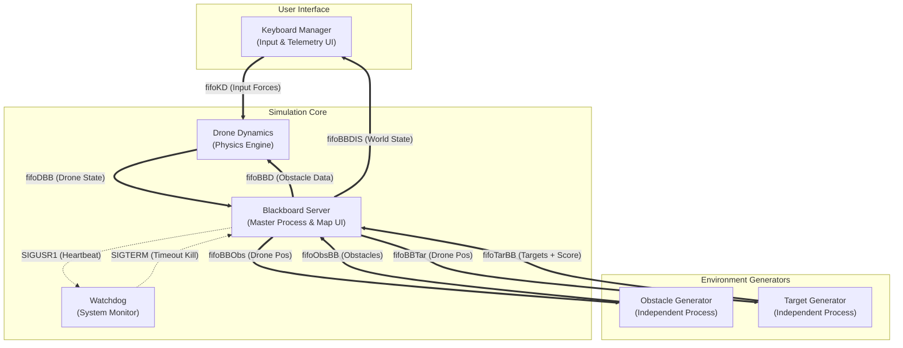
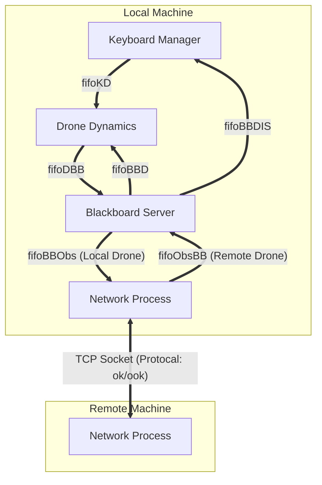

# Multi-Process C Drone Simulator

A real-time, terminal-based 2D drone simulation built in C for Linux.

## 📋 Overview

This project simulates the flight dynamics of a drone navigating a complex 2D environment. The objective is to pilot the drone to collect randomly spawning targets while avoiding dynamic obstacles and geofenced screen boundaries.

It is designed as a robust **Distributed System** running on a single machine (or across a network). Unlike simple monolithic programs, this application splits its logic into **six separate processes** that run concurrently. These processes communicate asynchronously using **Named Pipes (FIFOs)** for data exchange, **Unix Signals** for system control, and **TCP Sockets** for network multiplayer features.

The user interface is built using **ncurses** to provide a lag-free, real-time visualization of the map and telemetry data across multiple terminal windows.

## Key Features

- **Advanced Multi-Process Architecture**: The system uses `fork()` and `exec()` to spawn distinct executables for Physics, Input, UI, Environment Generation, and System Monitoring.

- **Blackboard Pattern**: A central Server process maintains the "source of truth" for the game state, synchronizing data between the simulation components.

- **Network Multiplayer (Assignment 3)**: Supports real-time connection between two instances via TCP sockets.
  - **Strict Protocol**: Implements a custom text-based handshake (`ok`/`ook`) and window size negotiation.
  - **Virtual Coordinates**: Automatically translates screen coordinates (top-left origin) to a virtual system (bottom-left origin) for cross-compatibility.

- **Physics Engine**: Implements 2D Newtonian mechanics. The drone possesses mass and inertia, requiring the user to manage thrust and momentum rather than simple coordinate movement.

- **Active Repulsion System**: The drone is physically pushed away from obstacles and window borders using inverse-distance repulsive force calculations (Latombe/Khatib model).

- **Dynamic Environment**: Targets and Obstacles are managed by independent processes that handle their own spawning logic, timers, and lifecycles.

- **Watchdog Fault Tolerance**: A dedicated Watchdog process monitors the system's heartbeat. If the Server hangs or crashes, the Watchdog triggers a safe emergency shutdown.

## 🏗️ Architecture

The system relies on a **Blackboard architecture**. The "Server" acts as the central repository of the game state, while specialized workers (Agents) perform calculations and update the Blackboard.

### Process Diagram (Standalone Mode)



### Process Diagram (Network Mode)

In **Network Mode**, the architecture adapts. The **Obstacle Generator**, **Target Generator**, and **Watchdog** are disabled. Instead, a **Network Process** is launched to bridge the local Blackboard to the remote machine.

The system cleverly **reuses the existing pipes** originally designed for the Obstacle Generator:
- `fifoBBObs` (normally "BB -> Obstacle Gen") is used to send the **Local Drone Position** to the Network Process.
- `fifoObsBB` (normally "Obstacle Gen -> BB") is used to receive **Remote Drone/Obstacles** from the Network Process.



### Network Architecture (Assignment 3)

In **Network Mode**, two instances run on separate machines. The system adheres to a strict requirement where generators (Obstacles/Targets) and Watchdog are disabled.

- **Server Mode**: Hosts the session. It sends its drone position to the Client and receives the Client's drone position, rendering it as a dynamic obstacle.

- **Client Mode**: Connects to the Server. It displays the Server's drone and sends its own position back.

- **Coordinate Normalization**: All network traffic uses a **Virtual Coordinate System** where the origin (0,0) is at the bottom-left. The system automatically converts Ncurses coordinates (top-left origin) before sending and after receiving:

```
y_virtual = MAP_HEIGHT - y_screen
```

## ⚙️ Installation & Compilation

### Prerequisites

This project runs on **Linux** systems. You need `gcc`, `make`, and the `ncurses` library installed.

```bash
sudo apt-get update
sudo apt-get install build-essential libncurses5-dev libncursesw5-dev
```

### Compilation

A `Makefile` is provided. From the project root directory, run:

```bash
make
```

This will generate all required executables including the main server linked with the new network_protocol module.

To clean up build files and old pipes:

```bash
make clean
```

## 🚀 How to Run

The application uses a smart launch script (`run.sh`) to manage configuration and processes.

1. Ensure the launch script is executable:

```bash
chmod +x run.sh
```

2. Run the launch script:

```bash
./run.sh
```

### Features of the Launcher

- **Auto-IP Detection**: Displays your local LAN IP address so you can easily share it with the Client.
- **Config Generation**: Automatically generates `param.conf` based on your menu selection. You never need to edit config files manually.
- **Smart Exit**: If you quit the game cleanly (press 'Q'), the window closes. If the game crashes, the window stays open so you can read the error logs.

### Startup Menu

- **Local (Standalone)**: Standard single-player simulation (Assignment 2).
- **Networked - SERVER**: Hosts the game. Binds to all interfaces (0.0.0.0).
- **Networked - CLIENT**: Asks for the Server's IP and connects.

## Controls

| Key | Action |
|-----|--------|
| Arrow Keys | Apply thrust in desired direction |
| Spacebar | Brake (Apply rapid damping force) |
| S | Start simulation physics |
| R | Reset drone position and score |
| Q | Safe Quit (Triggers clean shutdown) |

## 📂 Project Structure

```
├── assignmentsv6.0.pdf
├── BlackBoardServer
│   ├── Blackboard_functions.c
│   ├── Blackboard.h
│   └── BlackboardServer.c
├── common.c
├── common.h
├── DroneDynamics
│   ├── DroneController.c
│   └── DroneController.h
├── KeyboardManager
│   ├── Keyboard_functions.c
│   ├── KeyboardManager.c
│   └── KeyboardManager.h
├── Makefile
├── NetworkProcess.c
├── ObstaclesGenerator
│   ├── Obstacles_functions.c
│   ├── ObstaclesGenerator.c
│   └── ObstaclesGenerator.h
├── param.conf
├── README.MD
├── run.sh
├── Screenshot.png
├── TargetGenerator
│   ├── TargetGenerator.c
│   ├── TargetGenerator.h
│   └── Targets_functions.c
└── Watchdog
    └── Watchdog.c

```

## 🌐 Network Protocol Specification

The system implements the specific string-based protocol required by the assignment.

### 1. Handshake & Setup

| Direction | Message | Description |
|-----------|---------|-------------|
| Server → Client | `ok` | Connection established |
| Client → Server | `ook` | Acknowledge |
| Server → Client | `size w,h` | Send map dimensions (e.g., "size 80,24") |
| Client → Server | `sok size` | Strict acknowledgment string |

### 2. Game Loop Exchange

Cycle repeats every frame (30ms):

1. Server sends drone → sends `x,y` (Virtual Coords).
2. Client receives drone → receives `x,y` → sends `dok drone`.
3. Server sends `obst` (Requesting client pos).
4. Client receives `obst` → sends `x,y` (Local drone as Virtual Coords).
5. Server receives `x,y` → sends `pok obstacle`.

### 3. Termination

If a user presses 'Q':

1. Sender sends `q`
2. Receiver sends `qok` and both exit cleanly.

## 🔧 Changelog

### Assignment 1 & 2 (Completed)

✅ Multi-process architecture with fork/exec.  
✅ Independent generators for Targets and Obstacles.  
✅ Watchdog process for fault tolerance.  
✅ Physics engine corrections (smooth movement, repulsive forces).

### Assignment 3 (Final Release)

✅ **Network Manager**: TCP socket integration.  
✅ **Protocol Compliance**: Implemented strict text-based handshaking (`ok`/`ook`) and size exchange.  
✅ **Virtual Coordinates**: Implemented `y' = H - y` conversion to satisfy "Bottom-Left Origin" requirement.  
✅ **Smart Launcher**: `run.sh` now handles IP detection and `param.conf` generation automatically.  
✅ **Clean Shutdown**: Improved signal handling for network sockets and child processes.

## 👥 Contributors

**Basmala Sherief** - [@BasmalaSherief](https://github.com/BasmalaSherief)

## 📄 License

This project is developed for educational purposes as part of the ARP course at UniGe.