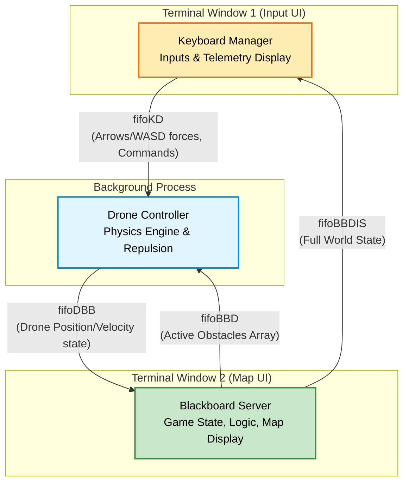

# Multi-Process C Drone Simulator

A real-time, terminal-based 2D drone simulation built in C for Linux.


## 📋 Overview

This project simulates the flight dynamics of a drone navigating a 2D map filled with obstacles and collectable targets.

It demonstrates advanced Unix systems programming concepts by splitting the application into **three separate processes** that communicate asynchronously via **named pipes (FIFOs)**. This architecture decouples physics calculations, user input handling, and central game state management.

The user interface is built using `ncurses` for real-time terminal visualization.

### Key Features
* **Multi-Process Architecture:** Uses `fork()` concepts separated into distinct executables communicating via blocking and non-blocking named pipes.
* **Physics Engine:** Implements 2D Newtonian mechanics including inertia, thrust, and drag (air resistance).
* **Repulsive Force Fields:** The drone is actively pushed away from obstacles and screen borders using inverse-distance repulsive force calculations.
* **Dynamic Game World:** Targets and obstacles spawn with varying lifetimes.
* **Real-Time UI:** Two separate Ncurses terminal windows showing the map view and real-time telemetry data (position, velocity, force vectors).

## 🏗️ Architecture

The system relies on a "Blackboard" pattern where a central server holds the absolute truth of the game state.



1.  **Blackboard Server:** The central hub. It maintains the world state (drone position, score, active targets/obstacles), runs the game logic (win condition, spawning), and draws the main map UI.
2.  **Drone Controller:** The physics brain. It receives input forces, calculates environmental repulsion forces locally, integrates acceleration into velocity and position, and reports its new state to the Blackboard.
3.  **Keyboard Manager:** Handles user input (blocking buffer reads) to send commands to the drone, and receives the full world state from the Blackboard to display telemetry data.

## ⚙️ Installation & Compilation

### Prerequisites
This project runs on Linux systems. You need `gcc`, `make`, and the `ncurses` library installed.

```bash
sudo apt-get update
sudo apt-get install build-essential libncurses5-dev libncursesw5-dev
```

### Compilation
A `Makefile` is provided for easy compilation. From the project root directory, run:

```bash
make
```

This will generate three executables: `server`, `drone`, and `keyboard`.

To clean up build files and old pipes:
```bash
make clean
```

## 🚀 How to Run

Because the application uses `ncurses` and splits displays across multiple windows, it must be launched using a script that spawns separate terminals.

1.  Ensure the launch script is executable:
    ```bash
    chmod +x run.sh
    ```

2.  Run the launch script:
    ```bash
    ./run.sh
    ```

*Note: The script uses `konsole` by default. If you are using a different terminal emulator (like `gnome-terminal` or `xterm`), you may need to edit `run.sh`.*

### Controls

Controls are entered in the "Input Display" window.

| Key | Action |
| :--- | :--- |
| **Arrow Keys** | Apply thrust in desired direction |
| **Spacebar** | Brake (Apply rapid damping force) |
| **S** | Start simulation physics |
| **R** | Reset drone position and score |
| **Q** | Quit all processes |

## 📂 Project Structure

```
.
├── Makefile           # Build instructions
├── README.md          # Project documentation
├── common.h           # Shared data structures (WorldState, DroneState, etc.)
├── run.sh             # Launch script for multi-terminal setup
│
├── BlackBoardServer/  # Central server and Map UI
│   └── BlackBoardServer.c
│
├── DroneDynamics/     # Physics engine implementation
│   └── DroneController.c
│
├── KeyboardManager/   # Input handling and Telemetry UI
│   └── KeyboardManager.c
│
├── ObstaclesGenerator/# Logic for obstacles and repulsive forces
│   ├── ObstaclesGenerator.c
│   └── ObstaclesGenerator.h
│
└── TargetGenerator/   # Logic for target spawning and collision
    ├── TargetGenerator.c
    └── TargetGenerator.h
```