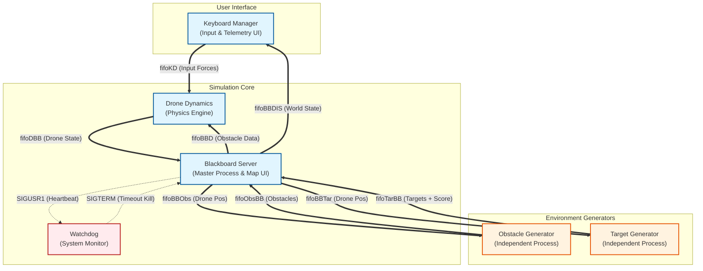

# Multi-Process C Drone Simulator
A real-time, terminal-based 2D drone simulation built in C for Linux.

## 📋 Overview
This project simulates the flight dynamics of a drone navigating a complex 2D environment. The objective is to pilot the drone to collect randomly spawning targets while avoiding dynamic obstacles and geofenced screen boundaries.

It is designed as a robust **Distributed System** running on a single machine. Unlike simple monolithic programs, this application splits its logic into **six separate processes** that run concurrently. These processes communicate asynchronously using **Named Pipes (FIFOs)** for data exchange and **Unix Signals** for system control and health monitoring.

The user interface is built using **ncurses** to provide a lag-free, real-time visualization of the map and telemetry data across multiple terminal windows.

### Key Features
- **Advanced Multi-Process Architecture**: The system uses `fork()` and `exec()` to spawn distinct executables for Physics, Input, UI, Environment Generation, and System Monitoring.
- **Blackboard Pattern**: A central Server process maintains the "source of truth" for the game state, synchronizing data between the simulation components.
- **Physics Engine**: Implements 2D Newtonian mechanics. The drone possesses mass and inertia, requiring the user to manage thrust and momentum rather than simple coordinate movement.
- **Active Repulsion System**: The drone is physically pushed away from obstacles and window borders using inverse-distance repulsive force calculations (Latombe/Khatib model).
- **Dynamic Environment**: Targets and Obstacles are managed by independent processes that handle their own spawning logic, timers, and lifecycles.
- **Watchdog Fault Tolerance**: A dedicated Watchdog process monitors the system's heartbeat. If the Server hangs or crashes, the Watchdog triggers a safe emergency shutdown.

## 🏗️ Architecture
The system relies on a **Blackboard architecture**. The "Server" acts as the central repository of the game state, while specialized workers (Agents) perform calculations and update the Blackboard.

### Process Diagram


### Component Descriptions
- **Blackboard Server**: The central hub. It maintains the absolute world state, synchronizes the generators, updates the map display, and broadcasts state data to the Drone and Keyboard processes.
- **Drone Controller**: The physics brain. It receives raw input forces, calculates acceleration based on drag and environmental repulsion, and integrates these values to update position and velocity.
- **Keyboard Manager**: Handles user input (non-blocking) and displays the "Cockpit" view with real-time telemetry (Velocity, Forces, Position).
- **Obstacle Generator**: An autonomous process that manages the lifecycle of obstacles (spawning, timers, despawning) and sends active obstacle data to the server via pipes.
- **Target Generator**: Similar to the obstacle generator, it manages the appearance of targets and calculates scoring events when the drone intercepts them.
- **Watchdog**: A silent background process that listens for a "Heartbeat" signal from the Server. If the system freezes (deadlock or infinite loop), the Watchdog terminates the simulation to prevent hung processes.

## ⚙️ Installation & Compilation

### Prerequisites
This project runs on **Linux** systems. You need `gcc`, `make`, and the `ncurses` library installed.

```bash
sudo apt-get update
sudo apt-get install build-essential libncurses5-dev libncursesw5-dev
```

### Compilation
A `Makefile` is provided for easy compilation. From the project root directory, run:

```bash
make
```

This will generate all required executables: `server`, `drone`, `keyboard`, `obstacle_process`, `target_process`, and `watchdog`.

To clean up build files and old pipes:

```bash
make clean
```

## 🚀 How to Run
Because the application uses ncurses and splits displays across multiple windows, it must be launched using the provided script.

1. Ensure the launch script is executable:
```bash
chmod +x run.sh
```

2. Run the launch script:
```bash
./run.sh
```

**Note**: The script uses `konsole` by default. If you are using a different terminal emulator (like `gnome-terminal` or `xterm`), you may need to edit `run.sh`.

### Controls
Controls are entered in the **Input Display** window.

| Key | Action |
|-----|--------|
| Arrow Keys | Apply thrust in desired direction |
| Spacebar | Brake (Apply rapid damping force) |
| S | Start simulation physics |
| R | Reset drone position and score |
| Q | Safe Quit (Triggers clean shutdown) |

## 📂 Project Structure
```
├── BlackBoardServer
│   ├── Blackboard_functions.c
│   ├── Blackboard.h
│   └── BlackboardServer.c
├── common.c
├── common.h
├── DroneDynamics
│   ├── DroneController.c
│   └── DroneController.h
├── KeyboardManager
│   ├── Keyboard_functions.c
│   ├── KeyboardManager.c
│   └── KeyboardManager.h
├── Makefile
├── ObstaclesGenerator
│   ├── Obstacles_functions.c
│   ├── ObstaclesGenerator.c
│   └── ObstaclesGenerator.h
├── README.MD
├── run.sh
├── screenshot.png
├── TargetGenerator
│   ├── TargetGenerator.c
│   ├── TargetGenerator.h
│   └── Targets_functions.c
└── Watchdog
    └── Watchdog.c
```

## 🔧 Assignment 1 Corrections (Changelog)
**Note**: This section details the specific corrections implemented in this version (Assignment 2) to address the feedback received on the Assignment 1 evaluation.

| Evaluation Item | Reported Issue | Correction Implemented |
|----------------|----------------|------------------------|
| 1. Solution Correctness | "Drone moves one pos to one pos" (Laggy/Discrete movement) | **Fixed**: Completely rewrote the physics engine in `DroneController.c`. The drone now uses proper Newtonian integration (Force → Acceleration → Velocity → Position) for smooth, fluid movement. |
| 1. Solution Correctness | "Obstacles too strong... no repulsive the edges" | **Fixed**: Tuned the repulsive force constants to be playable. Implemented a dedicated "Geofence" function that calculates repulsive forces from the window borders, preventing the drone from flying off-screen. |
| 3. Process Management | "No fork()" | **Fixed**: The system now correctly uses `fork()` and `execvp()` to spawn all child processes (Drone, Keyboard, Generators, Watchdog) via a wrapper function in `Blackboard_functions.c`. |
| 4. Error Handling | "No systematic debug output... zero errors checking" | **Fixed**: Added robust error checking for all critical system calls (Pipe creation, File opening, Read/Write). Implemented a `log_msg` function that writes detailed debug info to `simulation.log`. |
| 7. Code Quality | "Doesn't kill well" (Zombie processes) | **Fixed**: Implemented comprehensive Signal Handling (SIGINT, SIGTERM). The Master process now closes all file descriptors and uses `waitpid()` to ensure all children exit cleanly, eliminating zombie processes. |
```