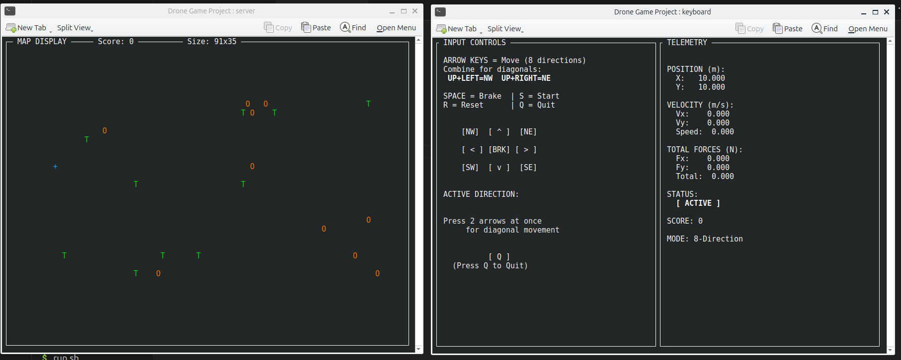
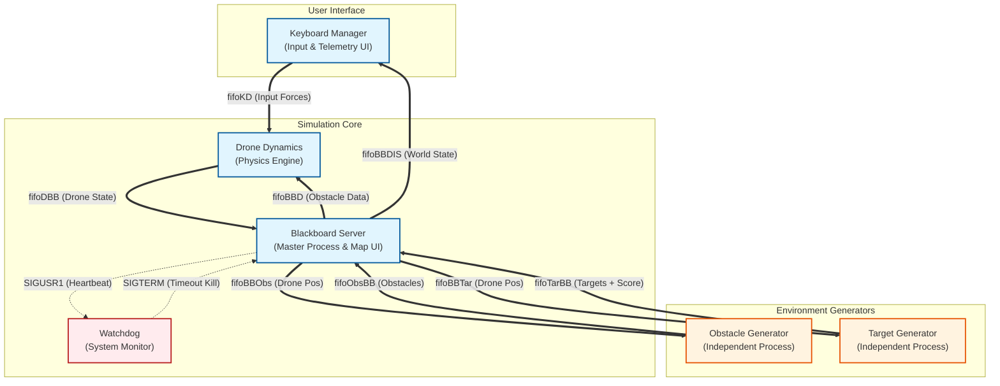

# Multi-Process C Drone Simulator

A real-time, terminal-based 2D drone simulation built in C for Linux.



## 📋 Overview

This project simulates the flight dynamics of a drone navigating a complex 2D environment. The objective is to pilot the drone to collect randomly spawning targets while avoiding dynamic obstacles and geofenced screen boundaries.

It is designed as a robust **Distributed System** running on a single machine (or across a network). Unlike simple monolithic programs, this application splits its logic into **six separate processes** that run concurrently. These processes communicate asynchronously using **Named Pipes (FIFOs)** for data exchange, **Unix Signals** for system control, and **TCP Sockets** for network multiplayer features.

The user interface is built using **ncurses** to provide a lag-free, real-time visualization of the map and telemetry data across multiple terminal windows.

### Key Features

- **Advanced Multi-Process Architecture**: The system uses `fork()` and `exec()` to spawn distinct executables for Physics, Input, UI, Environment Generation, and System Monitoring.
- **Blackboard Pattern**: A central Server process maintains the "source of truth" for the game state, synchronizing data between the simulation components.
- **Network Multiplayer** *(New in Assignment 3)*: Supports real-time connection between two instances via TCP sockets. One user acts as the Server (hosting the world) and the other as the Client (joining the world).
- **Physics Engine**: Implements 2D Newtonian mechanics. The drone possesses mass and inertia, requiring the user to manage thrust and momentum rather than simple coordinate movement.
- **Active Repulsion System**: The drone is physically pushed away from obstacles and window borders using inverse-distance repulsive force calculations (Latombe/Khatib model).
- **Dynamic Environment**: Targets and Obstacles are managed by independent processes that handle their own spawning logic, timers, and lifecycles.
- **Watchdog Fault Tolerance**: A dedicated Watchdog process monitors the system's heartbeat. If the Server hangs or crashes, the Watchdog triggers a safe emergency shutdown.

---

## 🏗️ Architecture

The system relies on a **Blackboard architecture**. The "Server" acts as the central repository of the game state, while specialized workers (Agents) perform calculations and update the Blackboard.

### Process Diagram (Standalone Mode)



### Network Architecture

In Network Mode, two instances of the application run on separate machines (or terminals). They communicate via TCP Sockets.

- **Server Mode**: Hosts the game session. It runs the physics for its own drone but disables the generators and watchdog. It receives the Client's drone position and treats it as a dynamic obstacle.
- **Client Mode**: Connects to the Server. It sends its local drone position (treated as an obstacle by the Server) and receives the Server's drone position to display.

### Component Descriptions

| Component | Description |
|-----------|-------------|
| **Blackboard Server** | The central hub. It maintains the absolute world state, synchronizes the generators, updates the map display, and broadcasts state data to the Drone and Keyboard processes. |
| **Network Manager** | Handles TCP socket creation, connection handshakes, and the serialization/deserialization of game state for network transmission. |
| **Drone Controller** | The physics brain. It receives raw input forces, calculates acceleration based on drag and environmental repulsion, and integrates these values to update position and velocity. |
| **Keyboard Manager** | Handles user input (non-blocking) and displays the "Cockpit" view with real-time telemetry (Velocity, Forces, Position). |
| **Obstacle Generator** | An autonomous process that manages the lifecycle of obstacles (spawning, timers, despawning) and sends active obstacle data to the server via pipes. |
| **Target Generator** | Similar to the obstacle generator, it manages the appearance of targets and calculates scoring events when the drone intercepts them. |
| **Watchdog** | A silent background process that listens for a "Heartbeat" signal from the Server. If the system freezes (deadlock or infinite loop), the Watchdog terminates the simulation to prevent hung processes. |

---

## ⚙️ Installation & Compilation

### Prerequisites

This project runs on **Linux** systems. You need `gcc`, `make`, and the `ncurses` library installed.

```bash
sudo apt-get update
sudo apt-get install build-essential libncurses5-dev libncursesw5-dev
```

### Compilation

A `Makefile` is provided for easy compilation. From the project root directory, run:

```bash
make
```

This will generate all required executables: `server`, `drone`, `keyboard`, `obstacle_process`, `target_process`, `watchdog`, and `network_manager`.

To clean up build files and old pipes:

```bash
make clean
```

---

## 🚀 How to Run

The application uses a launch script to manage the multiple process windows.

1. **Ensure the launch script is executable:**

```bash
chmod +x run.sh
```

2. **Run the launch script:**

```bash
./run.sh
```

### Startup Menu

Upon launching, you will be prompted to select an operation mode:

1. **Local (Standalone)**: Runs the standard single-player simulation (Assignment 2 features).
2. **Networked - SERVER**: Starts a game host on port 5555. Waits for a client connection.
3. **Networked - CLIENT**: Asks for an IP address and connects to an existing server.

> **Note**: The script uses `konsole` by default. If you are using a different terminal emulator (like `gnome-terminal` or `xterm`), you may need to edit `run.sh`.

### Controls

Controls are entered in the **Input Display** window.

| Key | Action |
|-----|--------|
| **Arrow Keys** | Apply thrust in desired direction |
| **Spacebar** | Brake (Apply rapid damping force) |
| **S** | Start simulation physics |
| **R** | Reset drone position and score |
| **Q** | Safe Quit (Triggers clean shutdown) |

---

## 📂 Project Structure

```
├── BlackBoardServer/
│   ├── Blackboard_functions.c
│   ├── Blackboard.h
│   └── BlackboardServer.c
├── common.c
├── common.h
├── DroneDynamics/
│   ├── DroneController.c
│   └── DroneController.h
├── KeyboardManager/
│   ├── Keyboard_functions.c
│   ├── KeyboardManager.c
│   └── KeyboardManager.h
├── Makefile
├── NetworkManager/
│   ├── NetworkManager.c
│   └── NetworkManager.h
├── ObstaclesGenerator/
│   ├── Obstacles_functions.c
│   ├── ObstaclesGenerator.c
│   └── ObstaclesGenerator.h
├── param.conf
├── README.MD
├── run.sh
├── Screenshot.png
├── TargetGenerator/
│   ├── TargetGenerator.c
│   ├── TargetGenerator.h
│   └── Targets_functions.c
└── Watchdog/
    └── Watchdog.c
```

---

## 🔧 Changelog

### Assignment 1 Corrections *(Previous)*

| Evaluation Item | Reported Issue | Correction Implemented |
|----------------|----------------|------------------------|
| **1. Solution Correctness** | "Drone moves one pos to one pos" (Laggy/Discrete movement) | ✅ **Fixed**: Changed the constants values of the motion equation in `DroneController.h`. |
| **1. Solution Correctness** | "Obstacles too strong... no repulsive the edges" | ✅ **Fixed**: Tuned the repulsive force constants to be playable for obstacles and borders. |
| **3. Process Management** | "No fork()" | ✅ **Fixed**: The system now correctly uses `fork()` and `execvp()` to spawn all child processes (Drone, Keyboard, Generators, Watchdog) via a wrapper function in `Blackboard_functions.c`. |
| **4. Error Handling** | "No systematic debug output... zero errors checking" | ✅ **Fixed**: Added robust error checking for all critical system calls (Pipe creation, File opening, Read/Write). Implemented a `log_msg` function that writes detailed debug info to `simulation.log`. |
| **7. Code Quality** | "Doesn't kill well" (Zombie processes) | ✅ **Fixed**: Implemented comprehensive Signal Handling (SIGINT, SIGTERM). The Master process now closes all file descriptors and uses `waitpid()` to ensure all children exit cleanly, eliminating zombie processes. |

### Assignment 2 *(Completed)*

- ✅ Full system implementation with all 6 processes
- ✅ Obstacle and Target generators with independent lifecycles
- ✅ Watchdog process with heartbeat monitoring
- ✅ Comprehensive logging system
- ✅ Robust error handling and graceful shutdown

### Assignment 3 *(Current)*

- ✅ Network Manager component for TCP socket communication
- ✅ Server/Client mode selection at startup
- ✅ Virtual coordinate system for cross-platform compatibility
- ✅ Handshaking protocol for reliable data exchange
- ✅ Client drone treated as dynamic obstacle on server side

---

## 🎮 Game Mechanics

### Physics Model

The drone follows 2D Newtonian dynamics with the motion equation:

```
ΣF = M(d²p/dt²) + K(dp/dt)
```

Where:
- `p` = drone position (x, y)
- `M` = mass (default: 1.0 kg)
- `K` = viscous friction coefficient (default: 1.0 N·s·m)
- `F` = sum of all forces (command + repulsive)

The equation is solved numerically using the Euler method with an integration timestep `T` of 10-100 ms.

### Force Types

1. **Command Forces**: Keyboard input in 8 directions, applied incrementally with each key press
2. **Repulsive Forces**: Latombe/Khatib potential field model
   - Perception radius: `ρ = 5m`
   - Strength parameter: `η = 0.1-10`
   - Applied by obstacles and geofence borders
   - Force diverges as distance approaches zero

---

## 🌐 Network Protocol

### Connection Flow

**Server:**
```
1. snd "ok" → rcv "ook"
2. snd "size l, h" → rcv "sok"
3. Loop:
   - if quit: snd "q" → rcv "qok" → exit
   - snd "drone" → snd x,y → rcv "dok"
   - snd "obst" → rcv x,y → snd "pok"
```

**Client:**
```
1. rcv "ok" → snd "ook"
2. rcv "size l, h" → snd "sok"
3. Loop:
   - rcv message
   - if "q": snd "qok" → exit
   - if "drone": rcv x,y → snd "dok"
   - if "obst": snd x,y → rcv "pok"
```

### Virtual Coordinate System

To ensure compatibility between different implementations, all coordinate data is translated to a **virtual coordinate system** with origin at the bottom-left before network transmission.

---

## 🐛 Debugging

### Log Files

The system generates detailed logs in `simulation.log` with timestamped entries for:
- Process lifecycle events (spawn, exit)
- IPC operations (pipe reads/writes)
- Physics calculations
- Network messages
- Error conditions

### Common Issues

| Issue | Solution |
|-------|----------|
| **"Broken pipe" error** | Ensure all processes are running. Check that FIFOs exist in `/tmp`. |
| **Zombie processes** | The system should handle cleanup automatically. If they persist, run `make clean` and restart. |
| **Network connection refused** | Verify server is running and port 5555 is not blocked by firewall. Check IP address is correct. |
| **Laggy movement** | Adjust physics constants in `DroneController.h`. |

---

## 📚 Academic Context

**Course**: Advanced and Robot Programming (ARP)  
**Institution**: University of Genoa  
**Assignment**: Multi-Process Drone Simulator (Assignments 1-3)

This project demonstrates:
- Inter-Process Communication (IPC) patterns
- Distributed system architecture
- Real-time physics simulation
- Network protocol design
- Process synchronization and fault tolerance

---

## 📄 License

This project is developed for educational purposes as part of the ARP course at UniGe.

---

## 👥 Contributors

- **Basmala Sherief** - [@BasmalaSherief](https://github.com/BasmalaSherief)

---

## 🔗 Resources

- [Assignment Specification](assignmentsv6.0.pdf)
- [ncurses Documentation](https://tldp.org/HOWTO/NCURSES-Programming-HOWTO/)
- [POSIX IPC Guide](https://man7.org/linux/man-pages/man7/pipe.7.html)
- [Latombe's Potential Fields](https://cs.stanford.edu/people/latombe/)

---
